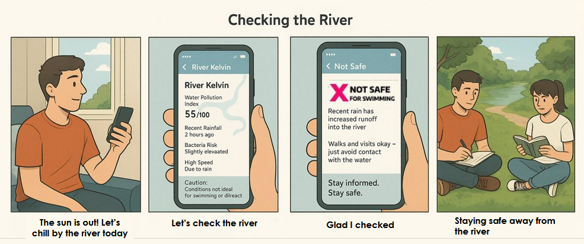

We first created a storyboard to better understand how the app should work, using online resources we were able to create a general process flow to better understand and see how the product should work.

After that, we created a low fidelity prototype on figma to visualize the app's possible layout and functionality.

The features are:

- General Safety Information
- Current Water Level
- Charts that show both historical data and also prediction
- Current Water Flow
- Latest River Pollution Data

Even though we had created a low fidelity prototype, we knew that there was still a lot of work to be done before it could be considered a viable product, as such we spend the rest of the day refining the prototype, removing while also adding to hopefully meet the requirements set by the partner